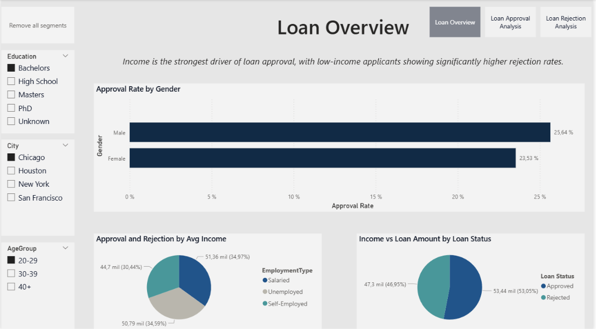

# Loan Approval Analysis - Data Visualization Project

This project focuses on the analysis and visualization of loan application data to identify approval and rejection patterns. Using Power BI, raw financial and demographic data were transformed into interactive dashboards to uncover trends, distributions, and decision-making factors in loan approvals.

## Project Overview

The main objective was to apply data visualization techniques to communicate loan approval behavior effectively and detect the main variables influencing the decision process.

### Key Features:

* **Interactive Dashboards:** Comprehensive analysis of loan approvals and rejections across different applicant profiles.
* **Custom Measures:** Implementation of DAX measures for approval rates, average income, and average loan amounts.
* **Interactive Filters:** Dynamic segmentation by education, city, and age group.
* **Comparative Analysis:** Side-by-side exploration of approved and rejected applications.
* **Pattern Detection:** Identification of income and employment trends related to loan outcomes.

## Tech Stack

* **Data Visualization:** Microsoft Power BI
* **Data Processing:** Excel / Power Query
* **Domain:** Finance & Risk Analysis

## Repository Structure

* `Loan Approval Dashboard.pbix`: Main Power BI project file including dashboards and data model.
* `Loan Dataset.xlsx`: Source dataset containing loan application records.

## How to View the Project

1. Download the `.pbix` file from this repository.
2. Install Power BI Desktop (Free).
3. Open the file to explore the interactive dashboards.

## Dashboards

### Loan Overview

Overview of the dataset with key KPIs and general applicant insights.

### Loan Approval Analysis

Focused analysis of approved loan applications by income group, education level, employment type, age group, and city.

### Loan Rejection Analysis

Focused analysis of rejected loan applications to compare patterns and identify risk indicators.

## Author

**Lihuén Natale**
Astronomy Student at Universidad Nacional de La Plata (UNLP).
Interested in Data Science, Data Visualization, and its applications across different domains.
